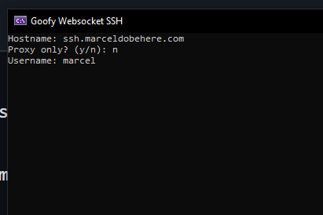

# Goofy Websocket SSH
A tool that lets you ssh into a server using a websocket, incase port 22 is blocked.

It essentially launches a local mini proxy that redirects tcp traffic over the websocket.

You can start SSH directly with it or you can set it to proxy only mode and then connect to localhost with the given port. (By default it is 6020)

This is a cross platform C# client. I am also working on a [web client](https://github.com/marceldobehere/goofy-web-ssh-client) that can be statically hosted / accessed locally.

NOTE: This should be used with the [Goofy Websocket Socket Bridge](https://github.com/marceldobehere/Goofy-Websocket-Socket-Bridge)!

## How to use
Launch the program and enter the hostname. It does not require `http://` or `ws://`, just the hostname. (`goofyssh.com`)

NOTE: By default it will use normal websockets (`ws://`) but you can specify the port to be 443 like `goofyssh.com:443` 
and then it will attempt to connect to a secure websocket server (`wss://`).

## How to run/build

You can either open the project in [Visual Studio](visualstudio.microsoft.com/) or [compile it manually](https://learn.microsoft.com/en-us/dotnet/core/install/linux).

NOTE: The project uses .NET 8

## Drawbacks

For some reason the `ClientWebSocket` in C# cannot communicate with a secure websocket server running in NodeJS.

This means that by default it is running with normal websockets. 

It might be fine if the secure websocket server is running in like C# but I have not been able to test it much.

## Images

